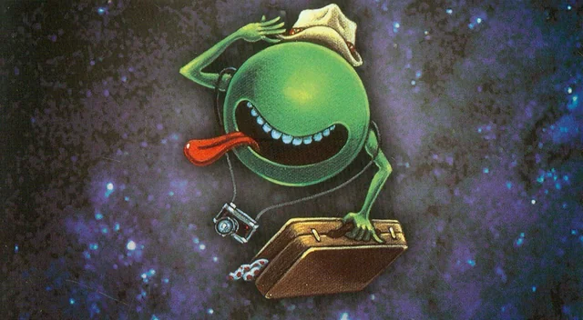

# Welcome, New Recruits!

The Hitchhiker's Guide to the Galaxy is the most **massively useful** guide for navigating the universe. As new members of the Guide's editorial team, your mission is to ensure its accuracy and expand its knowledge base.

But **beware!** The universe is a chaotic place, and the Guide is constantly evolving. You'll need to master the art of **Git** to keep up with the changes and collaborate with your fellow editors.

## **Your Adventure Begins**

Your first task is to familiarize yourself with the Guide's source code, which is written in **Markdown**. This lightweight markup language is easy to read and write, making it perfect for interstellar hitchhikers.

### 1. **Clone and Track the Guide:**

- Clone the "Hitchhiker's Guide to the Galaxy" repository to your local machine using the command `git clone https://github.com/vstokes/markdown-training`
- Navigate to the directory containing the cloned repository.
- Now Git is tracking the Guide, ready for your contributions!
  - validate with `git status`

### 2. **Pull the Latest Updates:**

- The Guide is constantly being updated by editors across the galaxy. Use `git pull origin main` to pull the latest changes from the main branch of the Guide's repository

#### **Merge Conflicts:**

> :warning: **Merge Conflict Shouldn't be Detected!** :warning:

- Uh oh! It looks like another editor has made changes to the same section you were working on. Resolve the merge conflicts carefully to avoid creating paradoxes in the space-time continuum.

### 3. **Create a Branch for Your Work:**

- Before making any changes, create a new branch using `git checkout -b <your-branch-name>`.
- This ensures that your work is isolated and can be reviewed separately.

### 4. **Push Your Contributions:**

- You've spotted a typo in the entry for Earth. It should be "Mostly Harmless," not "Mostly harmless."
- Make the correction and use `git commit -m "Fix typo in Earth entry"` to commit your change with a clear message.
- Now share your correction with the universe using `git push origin <your-branch-name>`.

### 5. **Create a Pull Request:**

- Your changes are ready for review. Create a pull request to merge your branch into the main branch of the Guide.
- Once your fellow editors have approved your changes, merge the pull request and celebrate your contribution to the Guide!

## **Congratulations, Editor!**

You've successfully navigated the basics of Git and contributed to the Hitchhiker's Guide to the Galaxy. But your adventure doesn't end here. The universe is vast and full of wonders, and the Guide is always in need of updates.

So grab your towel, don't panic, and keep exploring!
